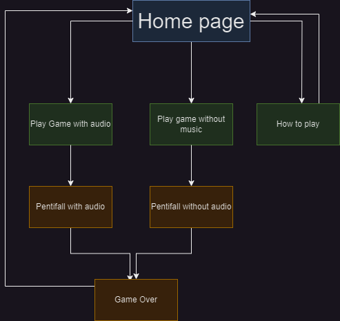

# Pentifall

The project, Pentifall, is my refreshing take on the classic block-dropping puzzle genre, paying homage to the beloved game, Tetris. However, it introduces a unique twist by utilising [Pentominoes](https://en.wikipedia.org/wiki/Pentomino), shapes formed by five square blocks, as opposed to the traditional [Tetrominoes](https://en.wikipedia.org/wiki/Tetromino) made up of four. This change is inspired by the original puzzle games that were the foundation for Tetris, intending to present a heightened challenge due to the increased block size.

By leveraging the complexity of Pentominoes, Pentifall aims to captivate players with intricate puzzle-solving scenarios and push their strategic capabilities to the limit. It's designed to cater to those who appreciate the simplicity of the original game, yet crave a further test of their skill and adaptability.

Regarding copyright, while Tetris Holding, LLC does have certain rights, these specifically cover the aspects of Tetrominoes, the 10x20 board size, and also the distinct colouring patterns used for Tetrominoes. Pentifall carefully navigates these intellectual property rights. I use Pentominoes instead of Tetrominoes and the board size and block colours in my game are entirely distinct, ensuring no infringement occurs.

The visual representation of the game is an often-overlooked element of copyright law in games. In fact, courts have ruled in the past that visual aspects, including specific colour schemes, can be considered proprietary. With Pentifall, I've been conscientious in this regard, devising a unique aesthetic that separates it from Tetris while maintaining the captivating nature of the puzzle genre. For an example of how a judge has ruled on this matter, please refer to this article: [Defining Tetris: How Courts Judge Gaming Clones](https://arstechnica.com/gaming/2012/06/defining-tetris-how-courts-judge-gaming-clones/)

<!-- UXD -->

<h2>User Experience Design (UXD)</h2>

<!-- Strategy -->

<h3>Strategy</h3>

<!-- Strategy - User Stories -->

<h4>User Stories</h4>

#### First Time Visitor Goals

- As a First Time User, I want to easily understand the main purpose of the game and learn more about its unique concept.
- As a First Time User, I want to be able to easily navigate the game interface, access instructions and start playing immediately.
- As a First Time User, I want to have a responsive gaming experience, allowing me to play on my desktop or mobile device seamlessly.
- As a First Time User, I want to find ways to follow the game's updates on different social media platforms.

#### Returning Visitor Goals

- As a Returning User, I want to experience new challenges and levels in the game that help me further enhance my problem-solving skills.
- As a Returning User, I want to be able to share my scores and compete with other users to increase the game's interactivity and excitement.
- As a Returning User, I want to be able to easily contact the game developer to provide feedback or report issues.

#### Frequent Visitor Goals

- As a Frequent User, I want to check if there are any updates, new levels or features added to the game.
- As a Frequent User, I want to keep track of my progress and improvements in the game over time.
- As a Frequent User, I want to subscribe to the game updates so that I receive notifications about any major changes, new challenges or game-related news.

<h4>Site Owner Goals</h4>

- As a Site Owner, I want to create an engaging and responsive game that provides a unique spin on classic puzzle mechanics.
- As a Site Owner, I want to inform users of any new updates, features or changes in the game, keeping them engaged and excited.
- As a Site Owner, I want to explore potential revenue avenues, such as in-app purchases or partnerships with game-related entities.
- As a Site Owner, I want to increase the exposure of the game on social media platforms, building a broader community of puzzle game enthusiasts.
- As a Site Owner, I want to receive feedback and communication from the users, allowing for game improvement and community engagement.
- As a Site Owner, I want to establish a bond with the users, allowing them to know the person behind the game, building trust, and a sense of community.

<!-- Strategy - Competition -->

<h4>Competition</h4>

[Tetris](https://en.wikipedia.org/wiki/Tetris): The timeless classic that started the falling block puzzle genre. Its simple mechanics, combined with its engaging gameplay, have made it a staple in the gaming world. It continues to appeal to a broad range of players, offering both casual and competitive gaming modes.

Strengths:

- Wide recognition: The game is a household name and synonymous with the falling-block puzzle genre.
- Simple yet addictive gameplay: Its mechanics are easy to understand but hard to master, which keeps players engaged.
- Multi-platform availability: It is available on almost all gaming platforms, allowing for a broad player base.

Weaknesses:

- Limited innovation: The game has largely remained the same since its inception, which might make some players seek more innovative alternatives.
- No multi-player: The classic version lacks real-time multiplayer capabilities, which are in high demand today.

[Tetr](Tetr.io): This is an online multiplayer version of Tetris. Its primary selling point is the ability to play against other players in real-time, offering both casual and competitive modes.

Strengths:

- Real-time multiplayer: It allows players to compete against each other in real-time, a feature that is not common in many Tetris-like games.
- Customisable experience: Players can adjust various game settings to their preference.

Weaknesses:

- Complexity: The various customisable settings may seem overwhelming to new or casual players.
- Less well-known: Compared to Tetris, it has lower brand recognition and popularity.

[Pentix (1986)](https://tetris.wiki/Pentix): Pentix is a variant of the classic Tetris game, developed and released in 1986. Like Tetris, it's a falling block puzzle game. The key distinction lies in its use of Pentominoes - geometric shapes composed of five square blocks - as opposed to Tetrominoes (four square blocks) used in classic Tetris. This increases the complexity of the gameplay and makes it more challenging for players. It was one of the first major adaptations of the Tetris concept.

Strengths:

- Unique mechanics: Utilising Pentominoes increases the complexity of the game, offering a new layer of challenge for players.
- Early innovator: Being an early variant of Tetris, it has historical significance in the evolution of falling block puzzle games.

Weaknesses:

- Dated graphics: As a game from 1986, the visual presentation can be considered outdated compared to modern games, potentially less appealing to younger audiences.
- Lower recognition: Despite its innovative gameplay, it's not as well-known as Tetris or other similar games, resulting in a smaller player base.
- Limited platforms: Being an older game, it might not be available on modern gaming platforms, limiting its accessibility.

<!-- Strategy - Strategy Tradeoffs -->

<h4>Strategy Tradeoffs</h4>

<!-- Scope -->

    
<h3>Scope</h3>

<!-- Scope - Sprint 1 -->

    
<h4>Sprint 1</h4>

#### Sprint 1 Features

- Build a responsive falling puzzle game
- Educate users on how to play the game - Inform users about the controls
- Option to play with or without music - Including a music option can enhance the overall gaming experience and keep player's more engaged.

#### Sprint 1 Requirement Types

- Languages: HTML, CSS & Javascript
- Text
- Audio

<!-- Scope - Sprint 2 -->

    
<h4>Sprint 2</h4>

#### Sprint 2 Features

- Community building through competition - Introducing score-sharing and leadboards can foster a sense of community and competition among players.
- Social media presence - An active social media presense can help keep the community engaged, provide updates and attrack new users.

#### Sprint 2 Requirement Types

- Languages: HTML, CSS & Javascript
- Text
- Audio

<!-- Scope - Sprint 3 -->

    
<h4>Sprint 3+</h4>

#### Sprint 3+ Features

- Adaptive difficulty levels - Catering to a wide range of players, from beginners to puzzle game veterans, by introducing different difficult settings can enhance user engagement.
- Interactive tutorials - A tutorial mode can help new usders understand the gameplay mechanics.
- Game updates and new challenges - Regularly updating the game with new levels or challenges can keep players engaged and returning.
- Monetisation - In-app purchases, such as aesthetic upgrades or additional challenges.

#### Sprint 3+ Requirement Types

- Languages: HTML, CSS & JavaScript
- Text
- Audio

<!-- Structure -->

    
<h3>Structure</h3>

Touchpoints - Responsive Website

<!-- Skeleton -->

    
<h3>Skeleton</h3>

<h4>Desktop Wireframes</h4>

<!-- Surface -->

    
<h3>Surface</h3>

<h4>Fonts</h4>

All text - [Press Start 2P](https://fonts.google.com/specimen/Press+Start+2P?preview.text=Please%20enter%203%20characters%20or%20more&preview.text_type=custom)
I'm going with Press Start 2P for all of my text as it lends itself well to a game.

<h4>Colours</h4>

Drawing significant inspiration from the classic Game Boy, I was intrigued by the distinctive green screen. This design choice was made to ensure optimal visibility for black colors. Despite my extensive search, I was unable to find a precise hexadecimal color code for this unique shade of green. Nevertheless, I opted for #9bbc0f.

For accurately capturing the colors of the physical Game Boy, I used the [Eye Dropper](https://eyedropper.org/) tool on an image of the [Game Boy](https://en.wikipedia.org/wiki/Game_Boy#/media/File:Game-Boy-FL.jpg). This approach provided me with a faithful representation of the console's iconic color palette.

<h4>Technologies Used</h4>

<h5>Languages</h5>

- HTML
- CSS
- Javascript

<h5>Websites, Software & other Tools</h5>

- [Codeanywhere](https://codeanywhere.com/solutions/collaborate) This is was my IDE for the project.
- [CodePen](codepen.io) I used this to test code outside of [Codeanywhere](https://codeanywhere.com/solutions/collaborate) so that I didn't use up hours unnecessarily.
- [Git](https://git-scm.com/) Used to commit and push code to [Github](https://github.com/).
- [Github](https://github.com/) This was used as a remote repository and I also used Github pages to host the live site.
- [Conventional Commits](https://www.conventionalcommits.org/en/v1.0.0-beta.2/) Used to learn and stick to a conventional commit framework.
- [Illustrator](https://www.adobe.com/uk/products/illustrator.html) Used to create image that I used for the favicon.
- [AdobeXD](https://helpx.adobe.com/support/xd.html) Used to create wireframes.
- [Google Fonts](https://fonts.google.com/) Sourcing fonts.
- [Google Webfonts Helper](https://gwfh.mranftl.com/fonts) Used to download google fonts in WOFF2 format.
- [W3Schools](https://www.w3schools.com/) Used to learn more about CSS and Javascript.
- [MDN Web Docs](https://developer.mozilla.org/en-US/docs/Web/JavaScript) Used to learn more about Javascript.
- [Youtube](https://www.youtube.com/) Used to learn more about Git, CSS and Javascript.
- [Codepen](https://codepen.io/sosuke/pen/Pjoqqp) Used to learn more about CSS and Javascript.
- [Am I Responsive?](https://ui.dev/amiresponsive) Used to create mock-ups for various screen sizes.
- [Dynamic Drive](http://tools.dynamicdrive.com/favicon/) Used to create favicon.

<!-- DEPLOYMENT -->

<h2>Deployment</h2>

I have deployed this website on GitHub Pages. To do this yourself, follow the steps below:

1. Log in to your GitHub account and navigate to the repository you wish to deploy.
2. Click on the "Settings" tab.
3. In the left-hand navigation menu, click on the "Pages" button.
4. Under "Source", click on the dropdown that says "None" and then select "main".
5. Wait for a few seconds and the page should automatically refresh.
6. In GitHub Pages, you can see the link to your published site.

To make a clone of this repository, follow these steps:

1. Login to your GitHub account.
2. Go to the repository by visiting the link: [Charlie McGoldrick Github - Synaptic Surge Repo](https://github.com/CharlieMcGoldrick/ci-ms1-synaptic-surge).
3. Click the "Code" button and then use the copy button next to the link to copy the link.
4. In your IDE of choice, open a new terminal and use the following clone command:
   `git clone <https://github.com/CharlieMcGoldrick/ci-ms1-synaptic-surge.git>`.
5. You will now have a copy of the repository in you local version.

To fork this repository, follow these steps:

1. Log in to your GitHub account.
2. Go to the repository you want to fork, which is located at:  [Charlie McGoldrick Github - Synaptic Surge Repo](https://github.com/CharlieMcGoldrick/ci-ms1-synaptic-surge).
3. In the top-right corner of the repository page, click on the "Fork" button
4. GitHub will prompt you to select where you want to fork the repository. Choose your personal account or organization.
5. Wait for the forking process to complete. Once it's done, you will be redirected to your forked repository under your GitHub account.

NOTE: Any changes pushed to the main branch automatically show up on the website.

<!-- Credits -->

<h2>Credits</h2>

- [W3Schools](https://www.w3schools.com/) Used to learn more about CSS and Javascript
- [MDN Web Docs](https://developer.mozilla.org/en-US/docs/Web/JavaScript) Used to learn more about Javascript.
- [Kevin Powell](https://www.youtube.com/@KevinPowell) Helpful CSS tips.
- [Free Code Camp](https://www.youtube.com/@freecodecamp) To learn JavaScript.
- [Am I Responsive?](https://ui.dev/amiresponsive) Used to create mock-ups for various screen sizes.
- [Color Space](https://mycolor.space/) Used to create colour palette.
- [Dynamic Drive](http://tools.dynamicdrive.com/favicon/) Used to create favicon.

<!-- Acknowledgements -->

<h2>Acknowledgements</h2>

- Thank you to Katherine Evans for creating a Viola and Piano rendition of the Korobeiniki folk song.
- Thank you to my mentor; Graeme Taylor and Code Institute (including the Slack community), for the great support, advice, and guidance.
- Thank you to my friends and family for their patience and understanding whilst working on this project.

