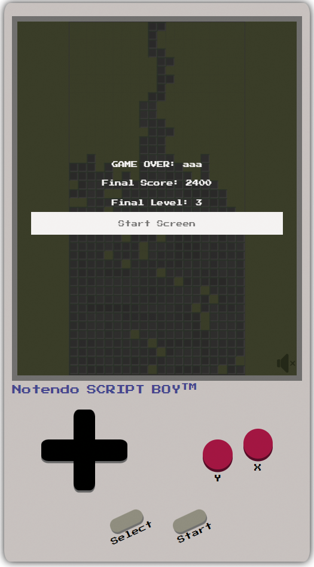

# Pentifall

The project, Pentifall, is my refreshing take on the classic block-dropping puzzle genre, paying homage to the beloved game, Tetris. However, it introduces a unique twist by utilising [Pentominoes](https://en.wikipedia.org/wiki/Pentomino), shapes formed by five square blocks, as opposed to the traditional [Tetrominoes](https://en.wikipedia.org/wiki/Tetromino) made up of four. This change is inspired by the original puzzle games that were the foundation for Tetris, intending to present a heightened challenge due to the increased block size.

By leveraging the complexity of Pentominoes, Pentifall aims to captivate players with intricate puzzle-solving scenarios and push their strategic capabilities to the limit. It's designed to cater to those who appreciate the simplicity of the original game, yet crave a further test of their skill and adaptability.

Regarding copyright, while Tetris Holding, LLC does have certain rights, these specifically cover the aspects of Tetrominoes, the 10x20 board size, and also the distinct colouring patterns used for Tetrominoes. Pentifall carefully navigates these intellectual property rights. I use Pentominoes instead of Tetrominoes and the board size and block colours in my game are entirely distinct, ensuring no infringement occurs.

The visual representation of the game is an often-overlooked element of copyright law in games. In fact, courts have ruled in the past that visual aspects, including specific colour schemes, can be considered proprietary. With Pentifall, I've been conscientious in this regard, devising a unique aesthetic that separates it from Tetris while maintaining the captivating nature of the puzzle genre. For an example of how a judge has ruled on this matter, please refer to this article: [Defining Tetris: How Courts Judge Gaming Clones](https://arstechnica.com/gaming/2012/06/defining-tetris-how-courts-judge-gaming-clones/)

<!-- UXD -->

<h2>User Experience Design (UXD)</h2>

<!-- Strategy -->

<h3>Strategy</h3>

<!-- Strategy - User Stories -->

<h4>User Stories</h4>

#### First Time Visitor Goals

- As a First Time User, I want to easily understand the main purpose of the game and learn more about its unique concept.
- As a First Time User, I want to be able to easily navigate the game interface, access instructions and start playing immediately.
- As a First Time User, I want to have a responsive gaming experience, allowing me to play on my desktop or mobile device seamlessly.
- As a First Time User, I want to find ways to follow the game's updates on different social media platforms.

#### Returning Visitor Goals

- As a Returning User, I want to experience new challenges and levels in the game that help me further enhance my problem-solving skills.
- As a Returning User, I want to be able to share my scores and compete with other users to increase the game's interactivity and excitement.
- As a Returning User, I want to be able to easily contact the game developer to provide feedback or report issues.

#### Frequent Visitor Goals

- As a Frequent User, I want to check if there are any updates, new levels or features added to the game.
- As a Frequent User, I want to keep track of my progress and improvements in the game over time.
- As a Frequent User, I want to subscribe to the game updates so that I receive notifications about any major changes, new challenges or game-related news.

<h4>Site Owner Goals</h4>

- As a Site Owner, I want to create an engaging and responsive game that provides a unique spin on classic puzzle mechanics.
- As a Site Owner, I want to inform users of any new updates, features or changes in the game, keeping them engaged and excited.
- As a Site Owner, I want to explore potential revenue avenues, such as in-app purchases or partnerships with game-related entities.
- As a Site Owner, I want to increase the exposure of the game on social media platforms, building a broader community of puzzle game enthusiasts.
- As a Site Owner, I want to receive feedback and communication from the users, allowing for game improvement and community engagement.
- As a Site Owner, I want to establish a bond with the users, allowing them to know the person behind the game, building trust, and a sense of community.

<!-- Strategy - Competition -->

<h4>Competition</h4>

[Tetris](https://en.wikipedia.org/wiki/Tetris): The timeless classic that started the falling block puzzle genre. Its simple mechanics, combined with its engaging gameplay, have made it a staple in the gaming world. It continues to appeal to a broad range of players, offering both casual and competitive gaming modes.

Strengths:

- Wide recognition: The game is a household name and synonymous with the falling-block puzzle genre.
- Simple yet addictive gameplay: Its mechanics are easy to understand but hard to master, which keeps players engaged.
- Multi-platform availability: It is available on almost all gaming platforms, allowing for a broad player base.

Weaknesses:

- Limited innovation: The game has largely remained the same since its inception, which might make some players seek more innovative alternatives.
- No multi-player: The classic version lacks real-time multiplayer capabilities, which are in high demand today.

[Tetr](Tetr.io): This is an online multiplayer version of Tetris. Its primary selling point is the ability to play against other players in real-time, offering both casual and competitive modes.

Strengths:

- Real-time multiplayer: It allows players to compete against each other in real-time, a feature that is not common in many Tetris-like games.
- Customisable experience: Players can adjust various game settings to their preference.

Weaknesses:

- Complexity: The various customisable settings may seem overwhelming to new or casual players.
- Less well-known: Compared to Tetris, it has lower brand recognition and popularity.

[Pentix (1986)](https://tetris.wiki/Pentix): Pentix is a variant of the classic Tetris game, developed and released in 1986. Like Tetris, it's a falling block puzzle game. The key distinction lies in its use of Pentominoes - geometric shapes composed of five square blocks - as opposed to Tetrominoes (four square blocks) used in classic Tetris. This increases the complexity of the gameplay and makes it more challenging for players. It was one of the first major adaptations of the Tetris concept.

Strengths:

- Unique mechanics: Utilising Pentominoes increases the complexity of the game, offering a new layer of challenge for players.
- Early innovator: Being an early variant of Tetris, it has historical significance in the evolution of falling block puzzle games.

Weaknesses:

- Dated graphics: As a game from 1986, the visual presentation can be considered outdated compared to modern games, potentially less appealing to younger audiences.
- Lower recognition: Despite its innovative gameplay, it's not as well-known as Tetris or other similar games, resulting in a smaller player base.
- Limited platforms: Being an older game, it might not be available on modern gaming platforms, limiting its accessibility.

<!-- Strategy - Strategy Tradeoffs -->

<h4>Strategy Tradeoffs</h4>

<!-- Scope -->

    
<h3>Scope</h3>

<!-- Scope - Sprint 1 -->

    
<h4>Sprint 1</h4>

#### Sprint 1 Features

- Build a responsive falling puzzle game
- Educate users on how to play the game - Inform users about the controls
- Option to play with or without music - Including a music option can enhance the overall gaming experience and keep player's more engaged.

#### Sprint 1 Requirement Types

- Languages: HTML, CSS & Javascript
- Text
- Audio

<!-- Scope - Sprint 2 -->

    
<h4>Sprint 2</h4>

#### Sprint 2 Features

- Community building through competition - Introducing score-sharing and leadboards can foster a sense of community and competition among players.
- Social media presence - An active social media presense can help keep the community engaged, provide updates and attrack new users.

#### Sprint 2 Requirement Types

- Languages: HTML, CSS & Javascript
- Text
- Audio

<!-- Scope - Sprint 3 -->

    
<h4>Sprint 3+</h4>

#### Sprint 3+ Features

- Adaptive difficulty levels - Catering to a wide range of players, from beginners to puzzle game veterans, by introducing different difficult settings can enhance user engagement.
- Interactive tutorials - A tutorial mode can help new usders understand the gameplay mechanics.
- Game updates and new challenges - Regularly updating the game with new levels or challenges can keep players engaged and returning.
- Monetisation - In-app purchases, such as aesthetic upgrades or additional challenges.

#### Sprint 3+ Requirement Types

- Languages: HTML, CSS & JavaScript
- Text
- Audio

<!-- Structure -->

    
<h3>Structure</h3>

Touchpoints - Responsive Website

<!-- Skeleton -->

    
<h3>Skeleton</h3>

<h4>Pentifall Wireframes</h4>

Start Screen

Game Screen

How To Play Screen

Game Over Screen

<!-- Surface -->

    
<h3>Surface</h3>

<h4>Fonts</h4>

All text - [Press Start 2P](https://fonts.google.com/specimen/Press+Start+2P?preview.text=Please%20enter%203%20characters%20or%20more&preview.text_type=custom)
I'm going with Press Start 2P for all of my text as it lends itself well to a game.

<h4>Colours</h4>

Drawing significant inspiration from the classic Game Boy, I was intrigued by the distinctive green screen. This design choice was made to ensure optimal visibility for black colors. Despite my extensive search, I was unable to find a precise hexadecimal color code for this unique shade of green. Nevertheless, I opted for #9bbc0f.

For accurately capturing the colors of the physical Game Boy, I used the [Eye Dropper](https://eyedropper.org/) tool on an image of the [Game Boy](https://en.wikipedia.org/wiki/Game_Boy#/media/File:Game-Boy-FL.jpg). This approach provided me with a faithful representation of the console's iconic color palette.

<h4>Technologies Used</h4>

<h5>Languages</h5>

- HTML
- CSS
- Javascript

<h5>Websites, Software & other Tools</h5>

- [Codeanywhere](https://codeanywhere.com/solutions/collaborate) This is was my IDE for the project.
- [CodePen](codepen.io) I used this to test code outside of [Codeanywhere](https://codeanywhere.com/solutions/collaborate) so that I didn't use up hours unnecessarily.
- [Git](https://git-scm.com/) Used to commit and push code to [Github](https://github.com/).
- [Github](https://github.com/) This was used as a remote repository and I also used Github pages to host the live site.
- [Conventional Commits](https://www.conventionalcommits.org/en/v1.0.0-beta.2/) Used to learn and stick to a conventional commit framework.
- [Illustrator](https://www.adobe.com/uk/products/illustrator.html) Used to create image that I used for the favicon.
- [AdobeXD](https://helpx.adobe.com/support/xd.html) Used to create wireframes.
- [Google Fonts](https://fonts.google.com/) Sourcing fonts.
- [Google Webfonts Helper](https://gwfh.mranftl.com/fonts) Used to download google fonts in WOFF2 format.
- [W3Schools](https://www.w3schools.com/) Used to learn more about CSS and Javascript.
- [MDN Web Docs](https://developer.mozilla.org/en-US/docs/Web/JavaScript) Used to learn more about Javascript.
- [Youtube](https://www.youtube.com/) Used to learn more about Git, CSS and Javascript.
- [Codepen](https://codepen.io/sosuke/pen/Pjoqqp) Used to learn more about CSS and Javascript.
- [Am I Responsive?](https://ui.dev/amiresponsive) Used to create mock-ups for various screen sizes.
- [Dynamic Drive](http://tools.dynamicdrive.com/favicon/) Used to create favicon.

<!-- FEATURES -->

<h2>Features</h2>

<h3>Navigation</h3>
All navigation is controlled with buttons. From the *Start Screen* you are able to navigate to:
- The *Game With Sound*
- The *Game Without Sound*
- *How To Play Page* that displays

From the _How To Play Page_ you are able to navigate to:

- The _Start Screen_

From the _Game Over Page_ you are able to navigate to:

- The _Start Screen_

You able to use these buttons either with a mouse, the keys used in the game (that are mapped to the ScriptBoy buttons) and the buttons on the ScriptBoy (actual buttons only work on touchscreen)

<h3>Game - Pentifall</h3>
A falling puzzle game where the objective is to fit pentominoes together so that you fill rows. When you fill a row (maximum 5 at a time), a line will be cleared and you will recieve points that increase depnding on how many you clear with one block. It includes multiple features:

- Input your name - Controlled by validation so that names use letters and are within a certain size.
- Play with or without music - There is a main theme song which loops; a rendition of the Korobeiniki Russian folk song.
- Scoreboard - Showing level and score.
- Next pentomino preview - so player can plan their moves.
- Ghost pentomino - You can see where your current pentomino is going to land based on it's current trajectory.
- Move pentomino left and right.
- Rotate pentomino clockwise and counter-clockwise.
- Increase pentomino fall speed.
- Make pentomino drop instantly
- Pause game
- Mute

- Game over screen - Displays the players name, score and the board as it was when the game goes to a fail state. Players can then navigate back to the start screen.

<h3>How To Play Page</h3>
Display the controls based on screen size.

<!-- BUGS -->

<h2>Bugs</h2>

<h3>Known Bugs</h3>

1. Unitended game over state - You can move a pentomino to the side of the board before it's showing and 'hook' it on one of the edges.
2. Pentomino ghost consistency - Pentomino ghost is a lighter colour for 1 game step and then becomes the consistent colour that I've set.
3. Pentomino preview - Pentomino preview display blocks at different sizes, this should be standardised.
4. Text glitch - When the select button is pressed there is an odd text glitch on the start button text.
5. Cycling through menu items with keys or d-pad is cycling through hidden buttons.
6. Pressed a button on the gameOverScreen plays the game over sound.
7. Left and Right sound isn't played for each movement when keys are held down, or pressing in quick succession. This is also the case when rotating the pentomino quickly.

<h3>Fixed Bugs</h3>

- [Start Menu not being hidden and Game Area not being displayed](https://github.com/CharlieMcGoldrick/ci-ms2-pentifall/commit/125a448757b8a1ceef63196730fca4eaab73ae41) - Change _=_ to _-_ so that the const is using the proper variable name.
- [Start Menu would show again after briefly showing game area](https://github.com/CharlieMcGoldrick/ci-ms2-pentifall/commit/4678ff341ab56b9206f82f4475b67a192d70e46a) - Remove the form tag, as I didn't actually need to input a form but just need the name input for validation and end screen.
- [gameCanvas wasn't being captured](https://github.com/CharlieMcGoldrick/ci-ms2-pentifall/commit/e39423c6ca0fe2d5146b34156706f4b488ceba4d) - Change the ID captured from _gameCanvas_ to _board_, which was the ID on the HTML Canvas tag.
- [pentominoPosition variable couldn't be found](https://github.com/CharlieMcGoldrick/ci-ms2-pentifall/commit/cde6eb663d54d0eb41c6e47893312ec54b1f8504) - Fixed spelling on variable.
- [Scope issue with gameBoard variable](https://github.com/CharlieMcGoldrick/ci-ms2-pentifall/commit/b30b382c74102f761d5a17d5faddd51ac117d9fb) - Remove _Let_ inside the function as it was already declared at the top of my script which gives it a global scope.
- [Pentominoes weren't showing on the board](https://github.com/CharlieMcGoldrick/ci-ms2-pentifall/commit/f456a3d27db121143a9ca8e85ece3dbb4bf954e0) - I gave the pentominoes a colour where the cells were being drawn.
- [Keys weren't being found](https://github.com/CharlieMcGoldrick/ci-ms2-pentifall/commit/0bc2d4c0bff5714af02c10a4929c0205ebaecf67) - Change keycode to strings of keys.
- [Game over state due to pentominoes not moving](https://github.com/CharlieMcGoldrick/ci-ms2-pentifall/commit/611e658c9fa7b254dfa0c1cec84c7144be2457fc) - In the _gameStep_ function I changed the pentomino generation to only happen when it can't move down anymore. I also added a boolean value to _movePentomino_ so that _gameStep_ knows whether the pentomino was moved successfully.
- [fastFallSpeed would only be active for a short time](https://github.com/CharlieMcGoldrick/ci-ms2-pentifall/commit/c29af702834f145e26f9100ddcbd75de855fee21) - Add a _currentSpeed_ variable, along with a boolean to check if the _down key_ is pressed down or not. If it is pressed down then the _currentSpeed_ is changed to _fastFallSpeed_.
- [Pentominoes weren't showing well on background](https://github.com/CharlieMcGoldrick/ci-ms2-pentifall/commit/7e4944fa5abb9d3ef537b9e48efad743b509e924) - Change all main colours to be a dark shade of greyscale.
- [moveSound is looped when the space is held down to rotate](https://github.com/CharlieMcGoldrick/ci-ms2-pentifall/commit/9f37c306bd2ac1e2a162c738712503d251fa4ceb) - Add a boolean (flag) to check whether the sound has been played on the key press.
- [Spacebar had wrong flag name](https://github.com/CharlieMcGoldrick/ci-ms2-pentifall/commit/4a3fbbeeb2b7a2e08e50cfebab1a2269b566079e) - Renamed flag to the variable name set at the top.
- [Pentominoes were placed off screen](https://github.com/CharlieMcGoldrick/ci-ms2-pentifall/commit/7b9c8c534ae7eb0b9e4fd07ba481ad70369cd06a) - Set the game canvas to fit within the size of the game screen based on the aspect ratio.
- [Off screen pentomino triggered game over state](https://github.com/CharlieMcGoldrick/ci-ms2-pentifall/commit/b5ce9432b01c44933a9ba00cb294d7fe5b641742) - Change the _isValidPosition_ function to not check blocks above the board, but then check if one is placed and hit's the top line.
- [Screen wasn't on top of the other elements](https://github.com/CharlieMcGoldrick/ci-ms2-pentifall/commit/a125dff383f6e7f7af2168b59785769598f38870) - Change _#screen_ to have _position:relative_ as _position:static_ doesn't work with z-index.
- [Some audio wasn't playing correctly](https://github.com/CharlieMcGoldrick/ci-ms2-pentifall/commit/566d7fec8c46343e3965ad46ae7af1f11e26f21b) - Change boolean value in _startGame_ function to _soundStatus_ and then store that vlaue in the _startGame_ variable.
- [Delay on fastFallSpeed](https://github.com/CharlieMcGoldrick/ci-ms2-pentifall/commit/cb7e26f26d6ae1f50805663bda1e0ff5f7f9a5ee) - I added the _gameStep_ function within the _key down_ controls so that these effects are instant.
- [dropPentomino can be held down](https://github.com/CharlieMcGoldrick/ci-ms2-pentifall/commit/cb7e26f26d6ae1f50805663bda1e0ff5f7f9a5ee) - This would cause frustrating gameplay, so I added a flag _isShiftKeyDown_.
- [404 error with sound icon images](https://github.com/CharlieMcGoldrick/ci-ms2-pentifall/commit/dcb93ddae181fe30d834af2ef2276d5ac34c0c35) - Removed `/` from the file path so that the images loaded correctly.
- [Sound would play when vame validation failed](https://github.com/CharlieMcGoldrick/ci-ms2-pentifall/commit/85c0efcb8548cd1c1187de1839eff07711ca5886) - Removed some code that starts playing the music when the _Play with Sound_ button is pressed.

<h2>Validation, Performance & Accessibility</h2>

<h4>Validation</h4>

All HTML passed the [w3C HTML Validation](https://validator.w3.org/nu/?doc=https%3A%2F%2Fcharliemcgoldrick.github.io%2Fci-ms2-pentifall%2F).

<h4>HTML Validation</h4>

All CSS passed the [w3C CSS Validation](https://jigsaw.w3.org/css-validator/validator?uri=https%3A%2F%2Fcharliemcgoldrick.github.io%2Fci-ms2-pentifall%2F&profile=css3svg&usermedium=all&warning=1&vextwarning=&lang=en).

<h4>CSS Validation</h4>

All JS passed the [JSHint](https://jshint.com/) validation.

<h4>JS Validation</h4>

There are only warnings regarding the use of certain techniques that require ES6.

<h3>Performance & Accessibility</h3>

I used [WAVE Web Accessibility Evaluation Tool](https://wave.webaim.org/) and it passed with 0 errors.

I also used [Google Lighthouse](https://developer.chrome.com/docs/lighthouse/overview) and it was in the high greens for performance, accessbility and best practises.

<h4>Google Lighthouse</h4>

Lighthouse Desktop Navigation Test

Lighthouse Mobile Navigation Test

Lighthouse Mobile Snapshot Test (I added this so that I can test the site whilst the game is running)

<!-- Application Testing -->

<h2>Application Testing</h2>

<h3>All Screen Sizes</h3>

<h3>Start Screen</h3>

Expected - When the site loads, the start screen should be presented. It should have an input, _Play with Sound_ button, _Play without Sound_ button & _How to Play_ Button displayed on the screen. At the bottom right of the screen should be a _sound off_ icon as the `isSoundOn` flag initially set to `False`. Below the screen should be the _physical_ buttons.
Testing - Tested the feature by loading the app.
Result - The feature responded as expected.

Expected - Inputting a name shorter than 3 characters or using numbers should throw up a relevant error. If both errors are met, then both errors should be displayed and the game shouldn't start.
Testing - Tested the feature by inputting a name shorter than 3 characters and inputting non-letters.
Result - The feature responded as expected.

<h4>Game Over Screen</h4>

Expected - Gameover screen should display the inputted name, _Final Score_, _Final Level_ and a _Start Screen_ button. In the background the gameboard should be displayed as it was before the user entered the gameover state.
Testing - Tested the feature by hitting the top of the game board which triggers the gameover state.
Result - The feature responded as expected.

Expected - Keys shouldn't be active in this screen.
Testing - Tested the feature by pressing/touching keys.
Result - There is a bug related to sound (See Known Bug 6), so it seems like the keys are still _active_.

<h3>Desktop</h3>

Tested on a 2560x1440 screen.

<h4>Start Screen</h4>
Expected - Hovering the cursor over the buttons should change the colour.
Testing - Tested the feature by using the cursor to hover over the buttons.
Result - The feature responded as expected.

Expected - Clicking the _Play with Sound_ button should start the game with sound and the _sound off_ icon should disappear.
Testing - Tested the feature by clicking the _Play with Sound_ button.
Result - The feature responded as expected.

Expected - Clicking the _Play without Sound_ button should start the game without sound and the _sound off_ icon should disappear.
Testing - Tested the feature by clicking the _Play without Sound_ button.
Result - The feature responded as expected.

Expected - Clicking the _How to Play_ button should display _How to play Screen_.
Testing - Tested the feature by clicking the _How to Play_ button.
Result - The feature responded as expected.

<h4>How To Play Screen</h4>

Expected - The desktop controls should be displayed.
Testing - Tested the feature by clicking the _How to Play_ button.
Result - The feature responded as expected.

Expected - Clicking the _Start Screen_ button should return the user back to the start screen.
Testing - Tested the feature by clicking the _Start Screen_ button.
Result - The feature responded as expected.

<h4>Game Screen</h4>

Expected - Pressing the right and left arrow key should move the pentomino respectivly. A sound should be played if the sound is on.
Testing - Tested the feature by pressing the right and left arrow key.
Result - The feature didn't respond as expected due to a bug related to sound (See Known Bug 7).

Expected - Holding the right and left arrow key should move the pentomino respectivly. A sound should be played if the sound is on.
Testing - Tested the feature by pressing the right and left arrow key.
Result - The feature didn't respond as expected due to a bug related to sound (See Known Bug 7).

Expected - Pressing the up arrow key should rotate the pentomino counter-clockwise. A sound should be played if the sound is on.
Testing - Tested the feature by pressing the up arrow key.
Result - The feature didn't respond as expected due to a bug related to sound (See Known Bug 7).

Expected - Pressing the down arrow key should rotate the pentomino clockwise. A sound should be played if the sound is on.
Testing - Tested the feature by pressing the down arrow key.
Result - The feature didn't respond as expected due to a bug related to sound (See Known Bug 7).

Expected - Pressing the spacebar should speed up the pentomino fall.
Testing - Tested the feature by pressing the spacebar.
Result - The feature responded as expected.

Expected - Holding the spacebar should speed up the pentomino fall.
Testing - Tested the feature by holding the spacebar.
Result - The feature responded as expected.

Expected - Pressing the shift key should instantly place the pentomino.
Testing - Tested the feature by pressing the shift key.
Result - The feature responded as expected.

Expected - Pressing the CTRL key should pause the game and the sound should stop.
Testing - Tested the feature by pressing the CTRL key.
Result - The feature responded as expected.

Expected - Pressing the M key should mute the game. The relative sound icon should be displayed.
Testing - Tested the feature by pressing M key.
Result - The feature responded as expected.

<h4>Game Screen</h4>

Expected - The music should loop
Testing - Tested the feature by playing the game.
Result - The feature responded as expected.

<h4>Game Over Screen</h4>

Expected - Clicking the _Start Screen_ button should return the user to the the _Start Screen_.
Testing - Tested the feature by clicking the _Start Screen_ button.
Result - The feature responded as expected.

<h3>Mobile</h3>

Tested on a Galaxy S8 screen.

<h4>Start Screen</h4>

Expected - Using the _dpad_ the cursor over the buttons should change the colour to signify what is currently selected.
Testing - Tested the feature by using the dpad to select menu elements.
Result - The feature technically works but there is a bug (See Known Bug 5).

Expected - Pressing the _x_ button should start the game or show controls if the button is currently selected.
Testing - Tested the feature by using the _dpad_ to select each button and then pressed _x_ to select that button.
Result - The feature responded as expected.

Expected - Touching the _Play with Sound_ button should start the game with sound and the _sound off_ icon should disappear.
Testing - Tested the feature by touching the _Play with Sound_ button.
Result - The feature responded as expected.

Expected - Touching the _Play without Sound_ button should start the game without sound and the _sound off_ icon should disappear.
Testing - Tested the feature by touching the _Play without Sound_ button.
Result - The feature responded as expected.

Expected - Touching the _How to Play_ button should display the _How to play Screen_.
Testing - Tested the feature by touching the _How to Play_ button.
Result - The feature responded as expected.

<h4>How To Play Screen</h4>

Expected - The mobile controls should be displayed.
Testing - Tested the feature by clicking the _How to Play_ button.
Result - The feature responded as expected.

Expected - Touching the _Start Screen_ button should return the user back to the start screen.
Testing - Tested the feature by touching the _Start Screen_ button.
Result - The feature responded as expected.

<h4>Game Screen</h4>

Expected - Touching the right and left dpad should move the pentomino respectivly. A sound should be played if the sound is on.
Testing - Tested the feature by touching the right and left arrow key.
Result - The feature didn't respond as expected due to a bug related to sound (See Known Bug 7).

Expected - Touching the up dpad should rotate the pentomino counter-clockwise. A sound should be played if the sound is on.
Testing - Tested the feature by touching the dpad.
Result - The feature didn't respond as expected due to a bug related to sound (See Known Bug 7).

Expected - Touching the down dpad should rotate the pentomino clockwise. A sound should be played if the sound is on.
Testing - Tested the feature by touching the down dpad.
Result - The feature didn't respond as expected due to a bug related to sound (See Known Bug 7).

Expected - Touching the Y action button should speed up the pentomino fall.
Testing - Tested the feature by touching the Y action button.
Result - The feature responded as expected.

Expected - Continuously touching the Y action button should speed up the pentomino fall.
Testing - Tested the feature by holding the Y action button.
Result - The feature responded as expected.

Expected - Touching the X action button should instantly place the pentomino.
Testing - Tested the feature by touching the X action button.
Result - The feature responded as expected.

Expected - Touching the Start button should pause the game and the sound should stop.
Testing - Tested the feature by touching the Start button.
Result - The feature responded as expected.

Expected - Touching the Select button should mute the game. The relative sound icon should be displayed.
Testing - Tested the feature by touching the Select button.
Result - The feature responded as expected.

<h4>Game Over Screen</h4>

Expected - Touching the _Start Screen_ button should return the user to the the _Start Screen_.
Testing - Tested the feature by touching the _Start Screen_ button.
Result - The feature responded as expected.

<!-- DEPLOYMENT -->

<h2>Deployment</h2>

I have deployed this website on GitHub Pages. To do this yourself, follow the steps below:

1. Log in to your GitHub account and navigate to the repository you wish to deploy.
2. Click on the "Settings" tab.
3. In the left-hand navigation menu, click on the "Pages" button.
4. Under "Source", click on the dropdown that says "None" and then select "main".
5. Wait for a few seconds and the page should automatically refresh.
6. In GitHub Pages, you can see the link to your published site.

To make a clone of this repository, follow these steps:

1. Login to your GitHub account.
2. Go to the repository by visiting the link: [Charlie McGoldrick Github - Pentifall Repo](https://github.com/CharlieMcGoldrick/ci-ms2-pentifall).
3. Click the "Code" button and then use the copy button next to the link to copy the link.
4. In your IDE of choice, open a new terminal and use the following clone command:
   `git clone <https://github.com/CharlieMcGoldrick/ci-ms2-pentifall>`.
5. You will now have a copy of the repository in you local version.

To fork this repository, follow these steps:

1. Log in to your GitHub account.
2. Go to the repository you want to fork, which is located at: [Charlie McGoldrick Github - Pentifall Repo](https://github.com/CharlieMcGoldrick/ci-ms2-pentifall).
3. In the top-right corner of the repository page, click on the "Fork" button
4. GitHub will prompt you to select where you want to fork the repository. Choose your personal account or organization.
5. Wait for the forking process to complete. Once it's done, you will be redirected to your forked repository under your GitHub account.

NOTE: Any changes pushed to the main branch automatically show up on the website.

<!-- Credits -->

<h2>Credits</h2>

- [W3Schools](https://www.w3schools.com/) Used to learn more about CSS and Javascript
- [MDN Web Docs](https://developer.mozilla.org/en-US/docs/Web/JavaScript) Used to learn more about Javascript.
- [Kevin Powell](https://www.youtube.com/@KevinPowell) Helpful CSS tips.
- [Free Code Camp](https://www.youtube.com/@freecodecamp) To learn JavaScript.
- [Am I Responsive?](https://ui.dev/amiresponsive) Used to create mock-ups for various screen sizes.
- [Color Space](https://mycolor.space/) Used to create colour palette.
- [Dynamic Drive](http://tools.dynamicdrive.com/favicon/) Used to create favicon.
- [Pixabay](https://pixabay.com/) Use for royality free sounds.

<!-- Acknowledgements -->

<h2>Acknowledgements</h2>

- Thank you to Katherine Evans for creating a Viola and Piano rendition of the Korobeiniki folk song.
- Thank you to my mentor; Graeme Taylor and Code Institute (including the Slack community), for the great support, advice, and guidance.
- Thank you to my friends and family for their patience and understanding whilst working on this project.

